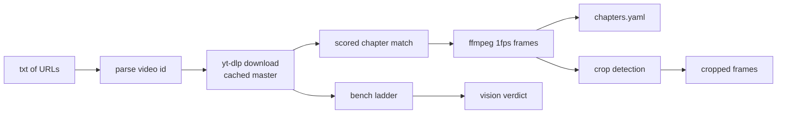

<p align="center">
  
  
  
</p>

# yt-code-vision-skill

Turn a YouTube coding tutorial into a sequence of code-pane frames + chapter
metadata for code-reading workflows — fully local, nothing leaves the project
folder.

A small Go CLI that takes a text file of YouTube URLs and, per video: downloads
a cached master (`yt-dlp`), finds the "coding" chapter, extracts one frame per
second (`ffmpeg`), and writes chapter metadata (`chapters.yaml`). It can also
auto-detect the IDE code pane and crop to it, and a `--bench` mode builds a
resolution ladder (`144p`→`1080p`) while `--bench-verdict` uses a vision model to
tell you the **lowest resolution that still reads code** — so you spend fewer
tokens on the frames you feed downstream.

## Why

Screen-recording tutorials bury the code between intros and talk. This pipeline
reduces a video to its code-pane frames plus chapter boundaries, so an LLM (or a
human) can read the code directly instead of scrubbing the timeline.

## Prerequisites

- **Go 1.24+**
- **yt-dlp**, kept current — the Aug-2026 YouTube regression (yt-dlp #17456)
  made earlier stable builds (e.g. 2026.07.04) return `HTTP 403` on every media
  download while metadata still worked; `scoop update yt-dlp` to ≥ 2026.08.19
  fixed it. If downloads suddenly 403, update yt-dlp before anything else.
- **Deno** — yt-dlp only auto-enables Deno by default (`node`/`bun` are ignored
  unless `--js-runtimes` is passed) and needs a JS runtime to solve YouTube's
  signature challenge; without one it silently falls back to clients YouTube
  blocks. The tool detects this and fast-fails with a clear "install Deno"
  message instead of burning a 5-minute backoff.
- **ffmpeg** and **ffprobe**
- `--bench-verdict` additionally needs **Node**, the `vision-inspect` helper,
  and a **DeepSeek API key**.

## Quickstart

```bash
# one-time: install the JS runtime yt-dlp needs
scoop install deno          # or: winget install DenoLand.Deno

# put video URLs in YT-URL-TEST.txt (one per line, '#' comments allowed), then:
go run ./cmd/yt-code-vision-skill
```

Re-running is idempotent: finished videos are skipped via a `.done` marker, and
downloaded masters are cached in `outputs/.cache/` for zero-network reuse.

## Flags

| Flag | Default | Purpose |
| --- | --- | --- |
| `--input <txt>` | `YT-URL-TEST.txt` | file of video URLs (one per line) |
| `--height <px>` | `1080` | max download height |
| `--start-chapter <kw>` | auto | start framing at the chapter whose title contains this |
| `--bench` | – | 5-min frames at 144/240/360/480/720/1080p |
| `--bench-verdict` | – | vision-model verdict: lowest code-readable resolution |
| `--find-crop` | – | auto-detect the code pane → `crop.json` + preview |
| `--crop-from-ref <png>` | – | green-box detect on a reference image → `crop.json` |
| `--crop-frames` | – | apply `crop.json` to all frames |
| `--fresh` | – | redo a video (old data moved to `outputs/.trash`) |
| `--purge-cache` | – | delete `outputs/.cache` and `outputs/.trash` |

## Output layout

```
outputs/<id>/frames/              full-res 1fps frames (frame_000001.jpg…)
outputs/<id>/chapters/chapters.yaml
outputs/<id>/crop.json            code-pane rect (auto or manual)
outputs/<id>/crop/                cropped code-pane frames
outputs/<id>/previews/            annotated preview images
outputs/.cache/<id>               cached masters (kept for reuse)
outputs/.trash/                   data moved aside by --fresh (recoverable)
bench/<id>/<res>p/                resolution ladder (+ <res>p-crop/)
```

## Pipeline



Details: [ARCHITECTURE.md](ARCHITECTURE.md)

## License

[MIT](LICENSE)
